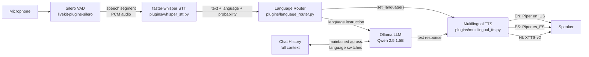

# Architecture: Polyglot Voice Pipeline

## Pipeline Diagram



## Component Responsibilities

### Silero VAD (`livekit-plugins-silero`)
- Detects start and end of speech from the microphone stream
- Sends complete audio segments to STT (eliminates silence/noise)
- Handles barge-in detection when the user interrupts the agent

### faster-whisper STT (`plugins/whisper_stt.py`)
- Receives PCM audio from VAD
- Runs `WhisperModel.transcribe()` to produce text + language code + probability
- Passes language to LanguageRouter

### Language Router (`plugins/language_router.py`)
- Thread-safe language state shared between STT and TTS
- Only updates language when `probability >= 0.7` (avoids misrouting on short phrases)
- Normalizes Urdu (`ur`) → Hindi (`hi`)
- Generates per-turn language instruction for the LLM prompt

### Ollama LLM (Qwen 2.5 1.5B)
- Receives the system prompt + full conversation history + language instruction
- Generates a response in the detected language
- The full chat history is maintained across language switches — context never resets

### Multilingual TTS (`plugins/multilingual_tts.py`)
- Routes to the correct TTS backend based on current language
- `en` → Piper en_US-lessac-medium (~200ms)
- `es` → Piper es_ES-carlfm-x_low (~200ms)
- `hi` → Coqui XTTS-v2 (~4000-8000ms) or pyttsx3 fallback

## Data Flow (Single Turn)

```
t=0ms     User stops speaking (VAD end-of-speech event)
t=30ms    Silero VAD fires, sends audio to STT
t=750ms   faster-whisper completes transcription → "Theek hai, delivery kab?" [hi, 0.88]
t=760ms   LanguageRouter updates: en → hi
t=762ms   LLM prompt constructed with language instruction
t=1900ms  Ollama returns first token (TTFT)
t=2600ms  Ollama completes response (~25 tokens)
t=2640ms  XTTS-v2 begins synthesis (for Hindi)
t=8600ms  XTTS-v2 completes, audio plays through speaker
```

**Total (Hindi turn on CPU): ~8.6 seconds** — significantly over the 1.2s target.
**Total (English/Spanish turn on CPU): ~2.6 seconds** — over target but closer.

See `docs/latency_budget.md` for the full analysis and GPU projections.

## Key Design Decisions

1. **No streaming STT**: faster-whisper processes complete utterances. VAD defines the utterance boundary. This simplifies the pipeline but adds 600-900ms vs streaming.
2. **Full chat history**: The LLM receives the entire conversation history every turn. This ensures context persists across language switches without any special handling.
3. **Language instruction injection**: Each turn prepends a brief language instruction to the system prompt. This is more reliable than relying on the system prompt alone.
4. **Lazy TTS backend loading**: XTTS-v2 takes ~30s to load. It's initialized at startup but synthesis starts immediately on the first Hindi turn.
